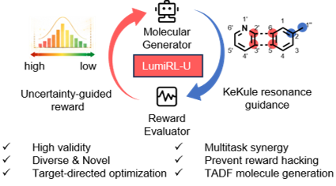

# RL-uncertainty
Implementation of "coming soon" by Xinxin Niu, Yixuan Xin, Yanfeng Dang, Yajing Sun, and Wenping Hu.  
(Paper: coming soon)

LumiRL-U is an uncertainty-aware hierarchical reinforcement learning framework for goal-directed generation and multi-property optimization of organic optoelectronic molecules, combining atom–motif representations with minimal-ring decomposition and Kekulé-resonance guidance to preserve chemically meaningful structures. By incorporating predictive uncertainty into the reward function, LumiRL-U mitigates reward hacking and enables reliable exploration of high-performance molecular candidates, as demonstrated in TADF molecule generation.

# 

## Environment
This package run under the environment:
* Python: 3.8

To install the package and dependencies:
```
conda create -n RL-uncertainty python==3.8.0
source activate RL-uncertainty
pip install setuptools==57.5.0
pip install .
pip install pyg_lib torch_scatter torch_sparse torch_cluster torch_spline_conv -f https://data.pyg.org/whl/torch-2.4.1+cu121.html
```

## Prerequisites for Running RL-uncertainty
1.data/FORMAT_vocab.csv: This is a non-redundant fragment set obtained by applying the Mol Tree principle to decompose all samples in the FORMAD dataset. To generate this file:
```
bash examples/run_prep_dataset.sh
```

2.examples/*.yaml: These files contain configuration settings for model training. You can modify or create them as needed.

3.examples/*.sh: These scripts are used to launch PPO-based reinforcement learning training. You may edit or create them as needed.

4.GNN_finetune_model/: This directory contains the pre-trained model(FORMAT_model.pt). If you wish to train the models yourself, you need to run:
```

python train.py --data_path data/SA_score.csv --split_sizes 0.8 0.1 0.1 --epochs 100 --depth 5 --dropout 0.35 --ffn_num_layers 3 --hidden_size 1400 --dataset_type regression --save_dir results/SA_score --ensemble_size 3 --aleatoric 
```

5.results/: This directory contains the RL results obtained from this study.

6.rjt_rl(main)/, scripts/: These directories contain the core code. In particular, rjt_rl/rjt implements the Mol Tree representation, and rjt_rl/rl includes the code for the agent, environment, and reward functions.

├── data/                          # Raw data storage
├── main/                          # Core model implementation code
├── scripts/                       # Pre-training scripts
├── examples/                      # Example usage and demo cases
├── requirements.txt               # Production dependencies
├── requirements-dev.txt           # Development dependencies
├── pyproject.toml                 # Project build configuration (PEP 621)
├── setup.cfg / setup.py           # Package distribution configuration
└── FORMAT_model.pt                # Pre-trained model weights file

## Usage
You can run a simple example using the following command:
```
bash examples/RL/run_step_dup_SA_rdkit.sh
```

## Citation
If you find our work relevant to your research, please cite:
```
@article{title={coming soon},
    author={Xinxin Niu, Yixuan Xin, Yanfeng Dang, Yajing Sun, and Wenping Hu},
    year={2025},
    journal={coming soon}
}
```
